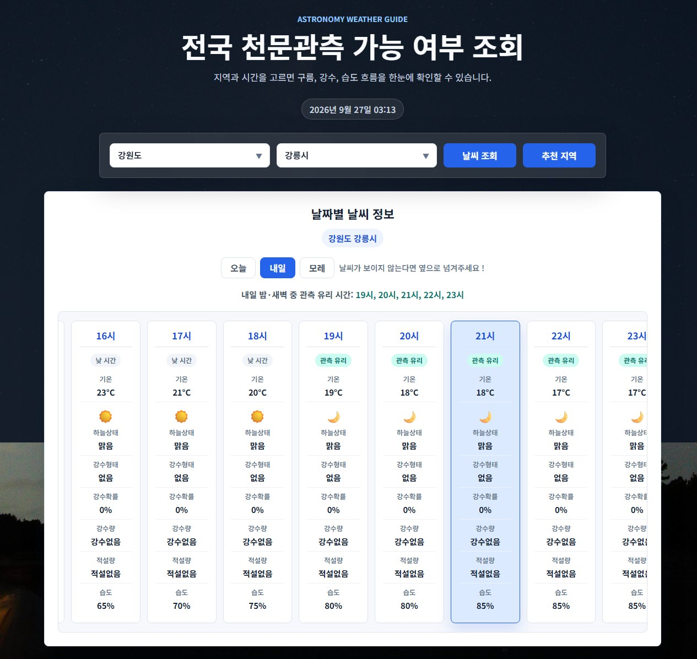
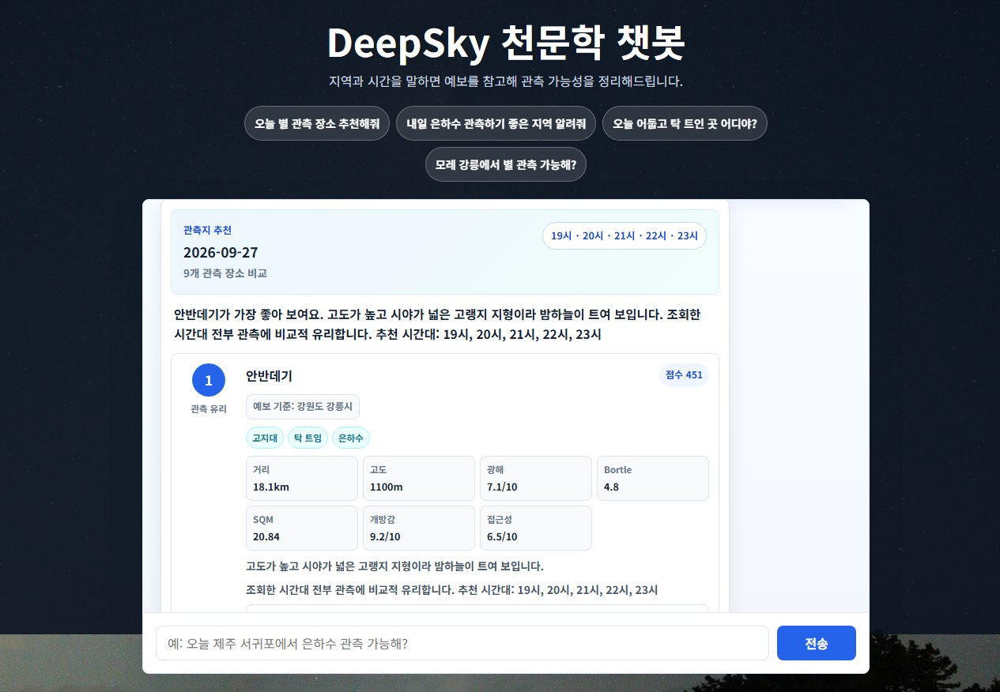
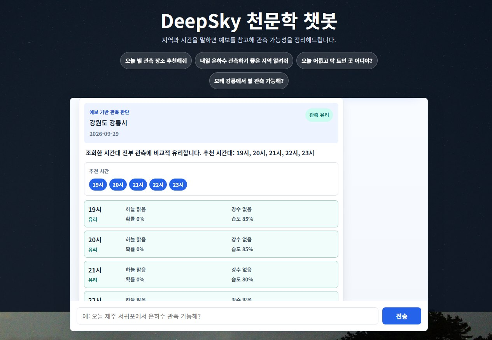
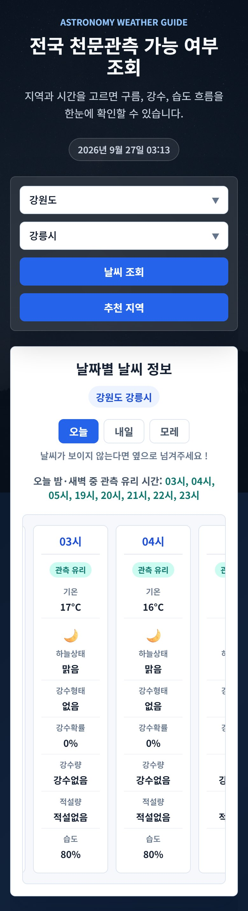
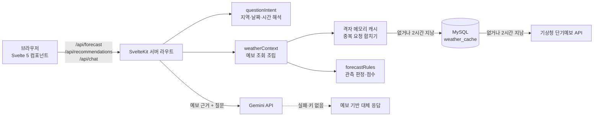

# DeepSky

[](https://github.com/zzmin0405/deepsky/actions/workflows/ci.yml)

기상청 단기예보와 관측지 데이터(광해·고도·개방감)를 조합해 **오늘 밤 별을 볼 수 있는지, 어디로 가면 좋은지** 알려주는 SvelteKit 애플리케이션입니다. 자연어로 질문하는 챗봇은 예보를 근거로 답하고, LLM을 쓸 수 없을 때도 예보 데이터만으로 답을 돌려줍니다.

| 시간대별 관측 판정 | 관측지 추천 챗봇 |
| --- | --- |
|  |  |

| 예보 기반 답변 카드 | 모바일 |
| --- | --- |
|  |  |

## 주요 기능

- **시간대별 관측 판정**: 오늘·내일·모레 24시간 예보에 밤·새벽(19~05시)만 관측 유리/불리를 표시하고, 유리한 시간을 요약합니다. 위치 권한을 허용하면 가까운 지역을 바로 조회합니다.
- **관측지 추천**: 관측지마다 광해·Bortle·SQM·고도·개방감·접근성 점수에 예보 점수를 더해 상위 3곳을 고릅니다. "근처", "제주", "강릉"처럼 질문 속 범위를 해석합니다.
- **예보 기반 챗봇**: 질문에서 지역·날짜·시간대를 읽어 예보를 찾고, Gemini에 근거로 넘깁니다. LLM 실패·키 없음·시간 초과 시에는 같은 예보로 만든 결정론적 답변을 돌려줍니다.
- **커뮤니티 게시판** (`/community`): 비밀번호로 수정·삭제하는 익명 게시판(scrypt 해시, 공개 조회에서 해시 제외, 비밀번호 대입 제한).

## 기술 스택

| 영역 | 사용 기술 |
| --- | --- |
| 프레임워크 | SvelteKit 2, Svelte 5 (runes), Vite 8, adapter-node |
| 데이터 | Prisma 5 + MySQL, 기상청 단기예보·한국천문연구원 출몰시각(공공데이터포털) |
| AI | Gemini API (`generateContent`, `systemInstruction`, `thinkingLevel`) |
| 품질 | Vitest 5, svelte-check, GitHub Actions |
| 배포 | Docker 멀티 스테이지 이미지(Node 22), AWS ECS Fargate + RDS 구성 문서 |

## 구조



```
src/
├─ routes/                  페이지와 API (+page.svelte, +server.js)
│  └─ api/                  chat, forecast, recommendations, rise-set, health, ready
├─ lib/
│  ├─ components/home/      LocationPicker, ForecastTimeline, TimelineColumn, RiseSetCard
│  ├─ components/chat/      ChatMessage, WeatherAnswerCard, RecommendationCard
│  ├─ server/               서버 전용: 외부 API 클라이언트, 캐시, 판정 규칙, 질문 해석
│  ├─ actions/              draggableScroll (Svelte action)
│  └─ *.js                  KST 시간, 표시 형식, 마크다운 정제, 브라우저 위치
prisma/                     스키마·마이그레이션·시드
tests/                      보안 회귀 테스트
docs/                       ADR, 도메인 규칙, 장애 기록, 배포 가이드
```

## 설계 포인트

- **비밀값은 서버 경계 안에만**: 외부 API 클라이언트는 모두 `$lib/server`에 있어서 SvelteKit이 브라우저 코드에서의 import를 빌드 단계에서 막습니다. 키는 `$env/dynamic/private`로 실행 시점에 읽어 빌드 결과물과 이미지에 남지 않습니다.
- **3단계 예보 캐시**: 예보 격자·날짜 단위 메모리 캐시 → MySQL(2시간) → 기상청 순으로 확인합니다. 같은 격자의 동시 요청은 하나로 합치고, 한 번 받은 응답은 날짜별로 나눠 재사용합니다. MySQL이 없어도 메모리 캐시와 내장 관측지 데이터로 동작합니다.
- **LLM은 문장만, 사실은 데이터에서**: 관측 판정·추천 순위는 규칙으로 계산하고 LLM은 설명 문장에만 씁니다. 그래서 LLM이 멈춰도 같은 근거로 답할 수 있습니다.
- **한국 시간 기준 계산**: 컨테이너 기본 시간대(UTC)와 관계없이 "오늘"과 기상청 발표 시각을 KST로 계산합니다.
- **테스트 가능한 순수 함수**: 질문 해석(`questionIntent`), 판정·점수(`forecastRules`), 응답 문장(`chatResponses`)을 I/O와 분리해 단위 테스트로 규칙을 고정했습니다.

## 트러블슈팅

#### 1. 브라우저 번들에 공공데이터 API 키가 들어감
- **문제**: 홈 화면이 브라우저에서 `http://apis.data.go.kr`를 직접 호출했습니다. 키가 클라이언트 번들에 포함됐고, HTTPS로 배포하면 mixed content로 차단되는 구조였습니다.
- **해결**: API 모듈을 `$lib/server`로 옮기고 `/api/forecast`, `/api/rise-set` 서버 라우트를 거치게 했습니다. 키는 환경 변수로 옮기고 https로 바꿨습니다.
- **확인**: 빌드 결과물 전체를 검색해 키와 `apis.data.go.kr` 호출이 0건인 것을 확인했습니다.

#### 2. 컨테이너에서 예보가 9시간 밀림
- **문제**: `new Date().getHours()`로 기상청 발표 시각과 "오늘"을 계산해, UTC인 Docker/ECS에서는 3회차 늦은 예보를 쓰고 새벽에는 날짜가 하루 어긋났습니다.
- **해결**: 고정 오프셋(UTC+9) 기반 `kstParts`·`kstToday` 헬퍼로 서버·화면 계산을 통일했습니다.
- **확인**: UTC·미국 서부·서울 시간대에서 같은 결과가 나오는지 테스트합니다.

#### 3. LLM 모델 종료로 챗봇이 대체 응답만 반환
- **문제**: 사용하던 `gemini-2.0-flash`가 2026-06-01에 종료돼 모든 LLM 호출이 실패했습니다.
- **해결**: 모델명을 `GEMINI_MODEL` 환경 변수로 빼고 기본값을 후속 모델로 바꿨습니다. Gemini 3 계열에 맞춰 `thinkingLevel: low`, `systemInstruction`을 쓰고, 추론 토큰이 출력 한도를 먹지 않게 한도를 조정했습니다.
- **확인**: 실제 호출에서 대체 응답 없이 2~5초 안에 답변이 오는 것을 확인했습니다.

#### 4. 비밀값 없이 Docker 이미지를 빌드할 수 없음
- **문제**: `$env/static/private`는 빌드 시점에 값이 있어야 해서, `.env`를 제외한 Docker 빌드가 `GEMINI_API_KEY is not exported` 오류로 실패했습니다. 값을 넣으면 이미지에 키가 남습니다.
- **해결**: `$env/dynamic/private`로 바꿔 실행 시점에 Secrets Manager 값을 읽게 했습니다.
- **확인**: `.env` 없는 복사본에서 기존 코드는 실패하고 새 코드는 빌드되는 것을 비교했습니다.

#### 5. 캐시가 있는데도 기상청을 반복 호출
- **문제**: 캐시 신선도를 첫 행의 조회 시각으로만 판단했습니다. 오늘의 이른 시간대 행은 이전 발표분에서만 채워지므로 캐시가 늘 오래된 것으로 판정됐습니다.
- **해결**: 가장 최근 조회 시각으로 판단하고, 방금 새로 받은 격자는 해당 날짜 행이 없어도 다시 부르지 않게 했습니다.

#### 6. "제주 서귀포"를 제주시로 해석 (테스트로 발견)
- **문제**: "제주"가 도 줄임말이자 "제주시"의 접미사를 뗀 이름이라 점수가 같아졌고, 먼저 나온 제주시가 선택됐습니다. "제주 관측지 추천"도 제주시 후보만 남겼습니다.
- **해결**: 도 줄임말과 같은 시 이름은 "제주시"처럼 전체 이름을 쓴 경우에만 시로 인정합니다.

#### 7. 20MB 배경 이미지
- 레이아웃 배경이 모든 페이지에서 20MB 원본을 받았습니다. EXIF 회전을 반영해 2048px로 다시 인코딩해 678KB로 줄였습니다.

## 로컬 실행

```powershell
npm install
Copy-Item .env.example .env   # 값을 채웁니다
npm run db:generate
npm run db:deploy             # MySQL을 쓸 때만
npm run db:seed
npm run dev
```

| 환경 변수 | 설명 |
| --- | --- |
| `DATA_GO_KR_SERVICE_KEY` | 공공데이터포털 서비스 키. 기상청 단기예보·천문연 출몰시각 조회에 씁니다. 인코딩·디코딩 키 모두 됩니다. |
| `GEMINI_API_KEY`, `GEMINI_MODEL` | 챗봇 답변 문장 생성. 키가 없거나 호출이 실패하면 예보 기반 대체 응답을 씁니다. 모델 기본값은 `gemini-3.6-flash`입니다. |
| `DATABASE_URL` | MySQL 연결 문자열. 없으면 예보는 메모리 캐시, 관측지는 내장 데이터로 동작하고 게시판만 쓸 수 없습니다. |
| `ORIGIN`, `ADDRESS_HEADER`, `XFF_DEPTH` | 운영 배포용. [배포 가이드](docs/aws-deployment.md)를 참고합니다. |

API 키는 실행 시점 환경 변수로 읽습니다. 빌드 결과를 로컬에서 실행할 때는 `node --env-file=.env build`처럼 환경 변수를 함께 넘깁니다.

## 테스트와 검증

```bash
npm run check   # svelte-check
npm test        # Vitest: 질문 해석, 판정·점수, 기상청 발표 시각, Gemini 요청, 컴포넌트 SSR, 보안 회귀
npm run build
```

GitHub Actions가 `main` 푸시와 PR마다 세 가지를 모두 실행합니다. 외부 API는 테스트에서 흉내 내므로 CI에는 비밀값이 필요 없습니다.

## 문서

- [AWS 배포 가이드](docs/aws-deployment.md): ECS Fargate, RDS, Secrets Manager, 마이그레이션 순서
- [MySQL 스키마](MYSQL_SCHEMA.md)
- [관측지 데이터 모델 결정 기록](docs/decisions/0001-observing-place-data-model.md), [관측 추천 규칙](docs/domain/observing-recommendations.md)
- [로컬 검증 규칙](docs/conventions/local-verification.md)

## 다음 단계

- 달의 위상·고도를 관측 판정과 추천 점수에 반영
- 여러 인스턴스 운영을 위해 rate limit과 예보 캐시를 Redis로 이전
- 월출·일출 정보를 선택한 지역 기준으로 표시
